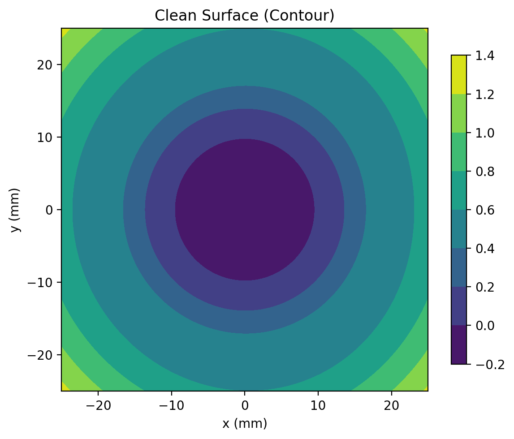
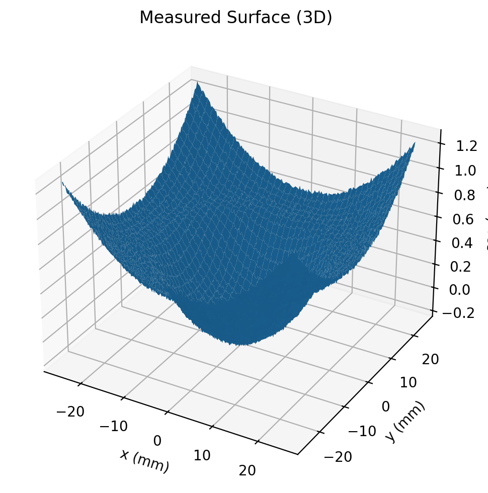
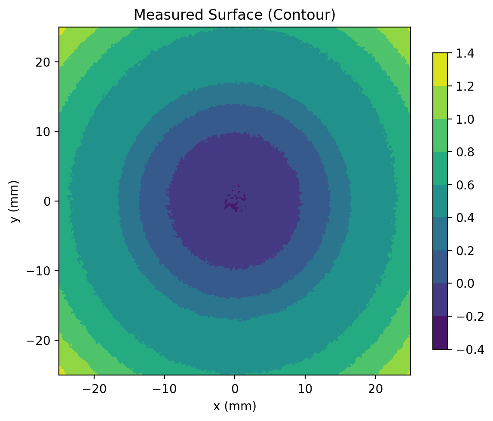

# 🔬 Lens Sim Starter  

[](https://www.python.org/)  
[](LICENSE)  
[](https://numpy.org/)  
[](https://matplotlib.org/)  

Synthetic **lens surface deformation simulation**:  
simulate a paraboloid lens surface, add **custom deformations + noise**, and visualize in **3D + contour**.  
Exports plots and numerical data for further analysis.  

---

## 📂 Example Output  

### 🔹 Clean Lens Surface (No Deformation + Noise)  
<p align="center">
  
  
</p>  

---

### 🔹 Noisy Lens Surface (With Measurement Noise)  
<p align="center">
  
  
</p>  

---

## 📊 Metrics (from `lens_sim_metrics.json`)  
- **Clean Surface** → PV ≈ 1.4656 mm, RMS ≈ 0.2983 mm, Mean ≈ 0.4394 mm  
- **Noisy Surface** → PV ≈ 1.4941 mm, RMS ≈ 0.2984 mm, Mean ≈ 0.4395 mm  

---

## 🚀 Usage  

Run with default parameters:
```bash
python lens_deformation_sim.py
